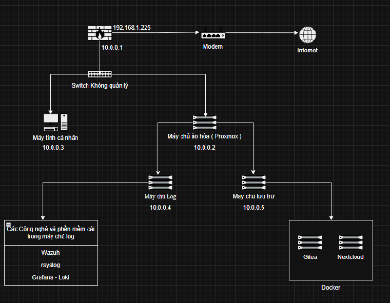

<h1 align="center"> THIẾT LẬP MẠNG CÁ NHÂN </h1>

## 1. Mục Tiêu
   Xây dựng một hệ thống mạng cá nhân, học cách sử dụng công nghệ ảo hóa để xây dựng các máy chủ
   tập trung log, hệ thống cảnh báo mạng và lưu trữ tài liệu. Sử dụng firewall để bảo vệ toàn hệ
   thống.

## 2. Nội Dung Chính.
>### Danh sách các công nghệ sử dụng và hệ điều hành và công cụ.
>* Hệ Điều Hành: Linux, Window, BSD
>
>    - Linux ( Distro Debian ): Cài đặt các hệ thống lưu trữ, tập trung log và hệ thống cảnh báo,
>        lý do vì tính ổn định. Các bản cập nhật của debian sẽ kiểm tra độ tương thích các gói với nhau
>        để tránh hệ thống bị lỗi.
>
>    - Linux ( Distro Arch Linux ): Để làm máy cá nhân và quản lý các máy chủ, lý do sử dụng vì tính
>        tùy biến và ít tốn tài nguyên ( chỉ cài những gói cần thiết phù hợp với nhu cầu sử dụng ).
>
>    - Linux ( Proxmox ): Sử dụng để tạo các máy chủ ảo hóa. Proxmox là một máy chủ ảo hóa miễn phí 
>        và mã nguồn mở, có nhiều chức năng của nhiều công nghệ như KVM ( công nghệ ảo hóa toàn phần cho
>        phép chạy một hệ điều hành như một máy ảo riêng biệt ), LXC ( ảo hóa cấp độ hệ điều hành, chỉchạy
>        các ứng dụng linux, nhẹ và tiết kiệm tài nguyên ). Lý do sử dụng vì Proxmox sử dụng ảo hóa loại 1
>        nên nó sẽ chạy trực tiếp trên phần cứng và không thông qua hệ điều hành chủ như các công nghệ ảo
>        hóa loại 2 ( Virtualbox, VMware ) nên hiệu suất của các máy chủ ảo sẽ cao hơn.
>
>    - BSD ( Opnsense ): Tường lửa mã nguồn mã được xây dựng trên BSD, lý do sử dụng có web quản lý
>        giúp việc xây dựng các quy tắc tường lửa, cài đặt, cập nhật, quản lý user quản trị dẽ dàng.
>
>    - Window: Sử dụng để cài các phần mềm chỉsử dụng được trên Window và sử dụng để kiểm tra các phần
>        mềm lập trình có tương thích được trên window không.
>
>* Công nghệ và phần mềm sử dụng:
>    - Docker: Dùng để tạo các máy chủ dịch vụ ( Gitea, Nextcloud ).
>
>    - Prometheus-Loki-Grafana: Một bộ công cụ để quản lý log và tài nguyên các máy chủ để theo dõi trong 
>    một dashboard duy nhất.
>
>    - Wazuh: SIEM mã nguồn mở, có thể phân tích dữ liệu từ các wazuh agent và cài các wazuh agent trên các firewall,
>    máy chủ, máy cá nhân để cảnh báo khi có các sự kiện liên quan đến bảo mật.
>
>    - FTP: Lưu trữ các file cấu hình, image docker và các bản log cũ.
>
>    - Gitea: Lưu trữ các dự án lập trình và để học cách sử dụng các tính năng của github như CI/CD và học cách quản lý
>    các dự án lập trình thông qua các bảng theo dõi lỗi.
>
>    - Nextcloud: Lưu trữ các video, ảnh, tài liệu.
>
>    - Lý do sử dụng 3 công nghệ lưu trữ khác nhau.
>
>         - FTP: Tốc độ truyền file nhanh, có thể viết các script tự động hóa khi thiết lập các cấu hình chung và lấy các bản log
>         cũ để phân tích để rút gọn thao tác.
>         
>         - Gitea: Github khi cập nhật lên bản code mới thì nó sẽ lưu lại các bản code cũ, để khi bản code mới bị lỗi có thể quay lại
>         các bản trước đó và tiện cho việc sữa lỗi vì có thể xem các chỉnh sữa ở bản mới so với bản cũ. Cơ chế nhánh trong github cũng
>         có thể giúp cho việc thêm tính năng và sửa lỗi không ảnh hưởng đến bản code chính.
>
>         - Nextcloud: Phù hợp sử dụng cho người dùng cuối vì có website thao tác thân thiện với người dùng, có thể đồng bộ dữ liệu và sử dụng trên nhiều thiết
>         bị, có thể xem tài liệu video trực tiếp trên website.
>
>### Sơ đồ hệ thống.
> - Hình ảnh sơ đồ hệ thống
>   
> 
> - Chi Tiết về sơ đồ
>   - Sử dụng máy tính (cấu hình CPU i3, ram 8gb) cài đặt opnsense để làm một tường lửa có nhiệm vụ chặn và cho phép các gói tin theo các quy tắc giữa mạng internet và
>   mạng nội bộ, đồng thời sử dụng để làm một máy chủ DHCP để cấp phát IP có các máy tính trong mạng nội bộ. Sử dụng thêm một card mạng kết nối đến một switch không 
>   quản lý để điều hướng các gói tin đến các máy tính con trong mạng nội bộ.
>
>   - Switch kết nối đến một máy cá nhân và một máy chủ ảo hóa ( cấu hình Ram 16GB, đĩa nvme 256GB, CPU Xeon E5-2676 v3 ) cài proxmox, bên trong proxmox tạo các máy chủ
>   SIEM, Log và Lưu trữ.
>
>   - Máy chủ SIEM và log sẽ dùng chung trong một máy ảo hóa, máy chủ có nhiệm vụ nhận log, wazuh agent, prometheus agent, prometheus exporter từ đó tổng hợp các dữ liệu
>   và theo dõi các dữ liệu đó thông qua một dashboard.
>       - Trong máy chủ cài đặt Wazuh ( một hệ thống quản lý sự kiện và thông tin an ninh ). Wazuh sẽ thu thập log các máy thông qua một wazuh agent từ đó sẽ phân tích 
>       các sự kiện bất thường và đưa ra cảnh báo.
>
>       - Trong máy chủ cài đặt grafana - loki ( một hệ thống tổng hợp dữ liệu và đưa các dữ liệu đó lên một trang dashboard để theo dõi ). Nhiệm vụ grafana trực quan các
>       dữ liệu log thô ( ví dụ: từ log cảnh báo wazuh thông qua grafana có thể tính toán được tổng số lượng rules xuất hiện trong một khoảng thời gian nhất định và thông 
>       qua đó giúp có thể nhận biết được bất thường trong mạng ).
>
>       - Trong máy chủ cài đặt Rsyslog ( một phần mềm thu thập log ). Nhiệm vụ tập trung tất cả các log từ các máy tính trong mạng lên một máy duy nhất dễ dàng cho việc phân
>       tích kiểm tra log thay vì phải truy cập nhiều máy khác nhau.
>
>       - Nhược điểm: khi cài đặt SIEM, tập trung log trong một máy chủ ảo hóa thì sẽ tốn tài nguyên ( tốn nhiều CPU để xử lý như việc ghi log vào ổ đĩa, SIEM cần CPU để phân 
>       tích, khi số lượng log đổ về nhiều thì việc ghi vào ổ đĩa và SIEM phân tích dữ liệu log thì sẽ gây ra tình trạng nghẽn cổ chai ).
>
>       - Ưu điểm: quản lý log và cập nhật sẽ dễ dàng hơn, tiết kiệm chi phí.
>
>       - Lý do sử dụng: Tiết kiệm chi phí, dễ dàng quản lý cho một hệ thống mạng cá nhân.
>
>   - Máy chủ lưu trữ ( tạo bàng máy chủ ảo hóa ): Nhiệm vụ lưu trữ log, tài liệu và cài đặt docker để tạo các microservice như gitea và nextcloud.
>
> - Nhược điểm sơ đồ: Kém bảo mật. Do cơ chế truyền gói tin của switch khi các máy tính trong mạng nội bộ chung một switch có thể truyền gói tin lẫn nhau mà không thông qua firewall
> nên máy tính cá nhân có thể truy cập được các trang quản lý máy chủ và các phiên ssh nên khi máy tính cá nhân dùng kết nối đến Internet có nguy cơ nhiễm mã độc và sẽ dễ dàng thấy
> máy chủ Proxmox và các máy chủ bên trong để tấn công.
>
>   - Khắc phục:
>
>       - Tạo mật khẩu an toàn ( sử dụng keepassxc để tạo một mật khẩu trên 25 ký tự với các ký tự ngẫu nhiên )
>
>       - Đang Thiết Lập: sử dụng tính năng VLAN trong proxmox, chia thành 2 VLAN có kết nối Internet và không kết nối Internet. VLAN kết nối Internet sẽ chứa một máy ảo có thể truy
>       cập internet, VLAN không kết nối Internet sẽ chứa máy chũ lưu trữ và biến máy tính cá nhân thành một máy chủ để quản lý các phiên SSH và các trang quản lý chung như proxmox,
>       firewall
